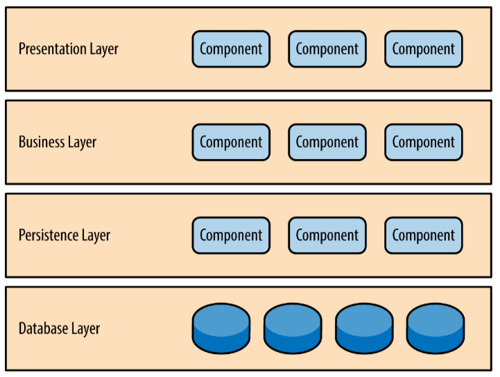

# Software Architecture
> Understanding Software Architecture Layer

Here's ilustration of Software Architecture Layer.

## Explanation

Each layer of the layered architecture pattern has a specific role and responsibility within the application. For example, a presentation layer would be responsible for handling all user interface and browser communication logic, whereas a business layer would be responsible for executing specific business rules associated with the request. Each layer in the architecture forms an abstraction around the work that needs to be done to satisfy a particular business request. For example, the presentation layer doesn’t need to know or worry about how to get customer data; it only needs to display that information on a screen in particular format. Similarly, the business layer doesn’t need to be concerned about how to format customer data for display on a screen or even where the customer data is coming from; it only needs to get the data from the persistence layer, perform business logic against the data (e.g., calculate values or aggregate data), and pass that information up to the presentation layer.  

## Need to Install

1. XAMPP (<https://www.apachefriends.org/download.html>)
2. Visual Studio Code (<https://code.visualstudio.com/>)
3. Database .SQL (<https://github.com/harrylicious/mls_pertemuan1_software_architecture/blob/master/database/sekolahku.sql>)
4. CodeIgniter 3 (<https://codeigniter.com/download>)

## References
Software architecture pattern (<https://www.oreilly.com/content/software-architecture-patterns/>)